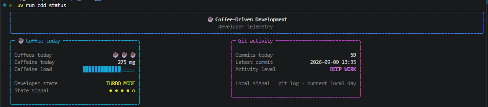
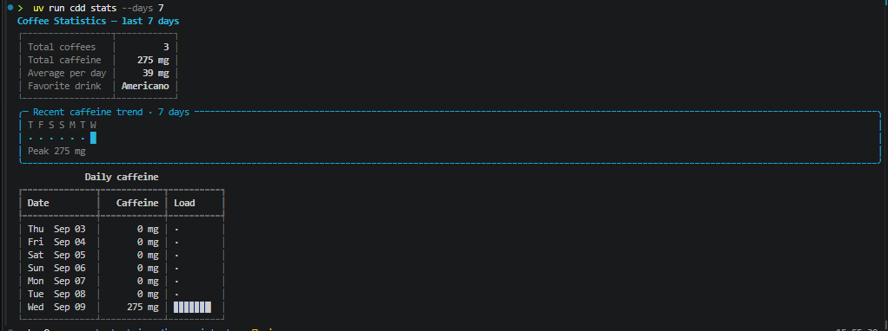
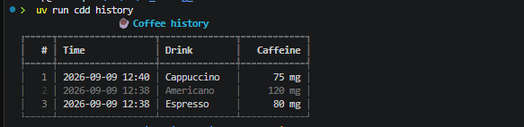
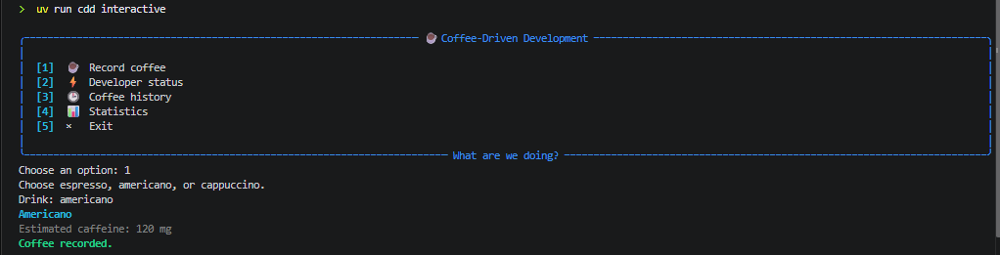

# Coffee-Driven Development

A deliberately over-serious coffee tracker built as a **small product sandbox
for AI-assisted software engineering**.

> **The coffee tracker is intentionally tiny.**
> The main goal of this repository is not to build a complex coffee application,
> but to explore how AI can be used effectively, safely, and repeatably across
> the software-development lifecycle.

Coffee-Driven Development combines:

1. a typed Python CLI that tracks coffee, caffeine, developer state, statistics,
   and local Git activity;
2. an AI engineering harness built around repository-owned specifications,
   reusable Skills, specialist agents, LangGraph orchestration, CI, independent
   review, and human-controlled merge decisions.

The product provides a deliberately understandable test bed for experimenting
with AI-assisted engineering practices such as specification-driven delivery,
agent orchestration, deterministic validation, resumable workflows, model
separation, and human-in-the-loop control.

In other words:

```text
small product
     +
AI engineering harness
     +
measurable delivery workflow
     =
the actual project
```

<p align="center">
  
</p>

## What this repository is meant to demonstrate

The repository is primarily an **AI engineering playground and portfolio
project**. The product stays intentionally small so the engineering system around
it can remain visible and explainable.

The areas being explored include:

- repository-owned instructions and reusable Skills;
- specialist coding, CI-triage, and PR-review agents;
- specification-driven development;
- LangGraph-based deterministic orchestration around probabilistic agents;
- persistent and resumable AI runs;
- isolated worktrees and conservative repository handling;
- TDD and deterministic local quality gates;
- GitHub Actions CI;
- exact-HEAD CI and review freshness;
- independent review by a model different from the implementation model;
- bounded retry policies and human escalation;
- human-controlled final merge decisions.

The longer-term goal is to keep improving the **AI-assisted development
framework around the product**, rather than growing the coffee tracker into a
large application for its own sake.

Observability and evaluation are a planned next area of exploration. In
particular, I intend to experiment with **Langfuse** as an observability layer
for feature-delivery runs once there is enough real model activity to make the
measurements useful. Potential signals include graph-node latency, model usage,
retry patterns, token/cost information, failure points, and evaluation scores.

Langfuse is therefore **not currently part of the implemented stack**. The
project deliberately avoids adding tools only for the sake of having more tools;
new infrastructure should have a concrete engineering or measurement purpose.

## Quick start

The project uses Python 3.12 and `uv`.

```console
uv sync --extra dev
uv run cdd status
```

Other commands:

```console
uv run cdd drink espresso
uv run cdd history --limit 10
uv run cdd stats --days 7
uv run cdd interactive
```

If the project's virtual environment is activated, the shorter `cdd ...`
commands are also available directly.

## Terminal experience

The CLI uses Rich for a terminal-native presentation layer while keeping domain
logic independent from rendering.

### Developer status

`cdd status` combines today's coffee telemetry with local Git activity.

<p align="center">
  
</p>

Developer state remains deterministic:

```text
0 mg       -> NO SIGNAL
1-100 mg   -> BOOTING
101-250 mg -> PRODUCTIVE
251-399 mg -> TURBO MODE
400+ mg    -> ARCHITECTURE PRIVILEGES REVOKED
```

### Coffee statistics

`cdd stats --days N` shows aggregate metrics, a compact caffeine trend, and
per-day load.

<p align="center">
  
</p>

### Coffee history

`cdd history` renders recent events newest-first in local time.

<p align="center">
  
</p>

### Interactive mode

`cdd interactive` exposes the same product behavior through a compact terminal
menu.

<p align="center">
  
</p>

## Product architecture

```text
CLI / orchestration
        |
        v
pure domain logic
        |
        v
local JSONL storage
```

The product runtime stays deliberately small:

```text
src/cdd/
├── cli.py
├── domain.py
├── git_activity.py
├── presentation.py
└── storage.py
```

- `cli.py` owns command orchestration and error boundaries.
- `domain.py` owns deterministic product rules.
- `storage.py` owns local JSONL persistence.
- `git_activity.py` reads deterministic local-day Git activity.
- `presentation.py` owns Rich terminal rendering.

The presentation layer can evolve visually without changing the product's
domain semantics.

## Why the product is intentionally small

The CLI is designed to be explainable in a few minutes. That keeps the product
easy to inspect while making the engineering workflow around it visible.

The repository is therefore deliberately asymmetric:

```text
small, deterministic product
        +
polished terminal presentation
        +
advanced AI engineering harness
```

The complexity budget is intentionally spent on the **delivery system**, not on
inventing unnecessary product scope.

That makes it easier to inspect questions such as:

- Can an AI-assisted run be resumed safely?
- Can deterministic gates prevent an agent from skipping validation?
- Is CI evidence still valid for the current commit?
- Can implementation and review be separated?
- When should automation stop and escalate to a human?
- How can AI development workflows be made observable and measurable?

The purpose is not to hide complexity inside the application. It is to make
the software-delivery system around a comprehensible application observable.

## AI engineering harness

The repository includes:

- persistent repository policy in [`AGENTS.md`](AGENTS.md);
- authoritative product requirements under [`spec/`](spec/README.md);
- reusable repository Skills under [`.agents/skills/`](.agents/skills/),
  including:
  - `create-feature-issue`
  - `develop-feature-tdd`
  - `manage-ai-run`
  - `prepare-pull-request`
  - `resolve-merge-conflict`
  - `sync-repository`
  - `validate-review-feedback`
  - `validate-pull-request`
  - `validate-specification`
- specialist agents under [`.github/agents/`](.github/agents/):
  - Feature Delivery Agent
  - CI Triage Agent
  - PR Autopilot Agent
- explicit LangGraph orchestration under
  [`ai_harness/feature_delivery/`](ai_harness/feature_delivery/);
- compact human-readable run state under [`.ai/runs/`](.ai/runs/);
- technical LangGraph SQLite checkpoints under `.ai/graph/`;
- deterministic quality gates and GitHub Actions CI;
- independent review and exact-HEAD evidence freshness;
- [`AI_WORKLOG.md`](AI_WORKLOG.md) for factual historical evidence.

Product runtime and AI orchestration are deliberately separated:

```text
src/cdd/       -> application
ai_harness/    -> explicit agent workflow orchestration
.agents/       -> reusable procedures
.github/agents -> specialist reasoning roles
spec/          -> intended product behavior
```

## Feature delivery workflow

The graph separates probabilistic engineering reasoning from deterministic
workflow control.

```text
User goal
   |
   v
GitHub Issue
   |
   v
Feature Delivery Agent
   |
   v
Feature Delivery Graph
   |
   +--> start / resume run
   |
   +--> validate scope
   |
   +--> claim Issue
   |
   +--> sync repository
   |
   +--> isolated worktree
   |
   +--> select relevant requirements from spec/
   |
   +--> TDD implementation
   |
   +--> validate specification
   |       |
   |       +--> mismatch -> bounded repair -> revalidate
   |       +--> ambiguity -> human gate
   |
   +--> local quality gate
   |       |
   |       +--> fail -> bounded repair -> rerun
   |
   +--> prepare pull request
   |
   +--> inspect current HEAD
   |
   +--> GitHub Actions CI
   |       |
   |       +--> fail -> CI triage -> correction -> quality gate -> CI
   |
   +--> mergeability check
   |       |
   |       +--> conflict -> resolve-merge-conflict -> full validation
   |
   +--> independent code review
   |       |
   |       +--> findings -> validate-review-feedback
   |                         |
   |                         +--> accepted fix
   |                              -> quality gate
   |                              -> CI
   |                              -> fresh review
   |
   +--> validate-pull-request
   |
   +--> verify current-HEAD evidence freshness
   |
   v
READY_FOR_HUMAN_MERGE
   |
   v
Human merge
```

The graph never performs the final merge and never enables auto-merge.

A HEAD-changing correction invalidates stale CI and review evidence. Final
readiness requires evidence for the same commit:

```text
current_head_sha == ci_sha == reviewed_sha
```

The implementation and reviewer models are also separated for independent
review.

For the detailed graph design, see
[`docs/ai/feature-delivery-graph.md`](docs/ai/feature-delivery-graph.md).

## Graph persistence

Two persistence layers intentionally serve different purposes:

```text
.ai/runs/
    -> compact, human-readable operational state

.ai/graph/*.sqlite3
    -> technical LangGraph checkpoints
```

The repository run record remains the human-readable operational source while
SQLite enables exact graph resumption.

## Planned AI engineering evolution

The project is intentionally iterative. Planned experiments should strengthen
the AI engineering harness rather than simply increase the number of tools in
the stack.

Current / near-term direction:

```text
repository Skills + specialist agents
        ↓
specification-driven feature delivery
        ↓
LangGraph orchestration and resumability
        ↓
GitHub CI + independent review
        ↓
end-to-end graph-driven feature demo
        ↓
observability / evaluation experiments
        ↓
Langfuse (planned)
```

A future Langfuse integration would be intended to answer concrete questions
such as:

- Which graph stages consume the most time?
- Which stages require the most retries?
- Which model performed implementation or review?
- What are the token and cost characteristics of a delivery run?
- Where do feature-delivery runs commonly fail or escalate?
- How can different model/workflow variants be compared with evaluation scores?

This observability layer is intentionally planned rather than prematurely
integrated.

## Validation

The product and harness are validated with:

```console
uv run --extra dev pytest
uv run --extra dev ruff check .
uv run --extra dev mypy
git diff --check
```

Production-code coverage is enforced at **>= 90%**.

## Evidence and documentation

- [`AI_WORKLOG.md`](AI_WORKLOG.md)
- [`docs/IMPLEMENTATION_PLAN.md`](docs/IMPLEMENTATION_PLAN.md)
- [`docs/ai/feature-delivery-graph.md`](docs/ai/feature-delivery-graph.md)
- [`docs/ai/model-usage.md`](docs/ai/model-usage.md)
- [`docs/ai/github-integration-capabilities.md`](docs/ai/github-integration-capabilities.md)

## Product specification

[`spec/`](spec/README.md) is the authoritative repository-owned description of
intended product behavior and architecture constraints.

Implementation and tests are evidence of conformance, not replacements for the
specification.

Specification-aware delivery uses the
[`validate-specification`](.agents/skills/validate-specification/SKILL.md)
Skill before later quality and PR-readiness gates.

## Future end-to-end demo

The repository currently contains **three intentionally specified but not yet
implemented product features**. Any of them can be used as the subject of a
full end-to-end feature-delivery demonstration:

| Candidate feature | Specification | Main engineering angle |
| --- | --- | --- |
| **Late-Night Refactor Risk** | [`CDD-RISK-001`–`CDD-RISK-009`](spec/features/late-night-refactor-risk.md) | deterministic risk scoring from local time, caffeine, and Git activity |
| **Backdated Coffee Recording** | [`CDD-HIST-001`–`CDD-HIST-009`](spec/features/backdated-coffee-recording.md) | CLI/API-of-the-command design, timezone-aware historical input, validation, persistence, and downstream statistics |
| **Interactive Drink Picker** | [`CDD-PICK-001`–`CDD-PICK-009`](spec/features/interactive-drink-picker.md) | richer domain-owned drink catalog plus a polished Rich-based interactive selection flow |

All three are deliberately kept in the **specified, not implemented** state so
that one can be selected later and delivered through the complete AI-assisted
engineering workflow rather than added manually in advance.

The intended demo path is:

```text
feature specification
        ↓
GitHub Issue
        ↓
Feature Delivery Graph
        ↓
scope + requirement selection
        ↓
TDD implementation
        ↓
specification validation
        ↓
local quality gate
        ↓
pull request
        ↓
GitHub Actions CI
        ↓
independent model review
        ↓
feedback / repair loops if needed
        ↓
exact-HEAD readiness validation
        ↓
READY_FOR_HUMAN_MERGE
        ↓
human merge
```

The point of the demo is therefore not the complexity of the selected coffee
feature itself. The feature acts as a controlled workload for demonstrating the
AI engineering framework around it: specification-driven delivery, bounded
agent execution, deterministic gates, resumability, CI/review freshness, and
human-controlled release decisions.
